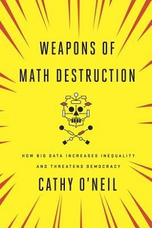

The whole title kind of speaks for itself (Weapons of Math Destruction: How big data increases inequality and threatens democracy). The book is about data science ethics and algorithms gone awry. The book gives a harrowing look into the world of the 'algorithm'. In quotes because its more about our world; how we interact with algorithms, the effects they have on us, what we feed them and where they live. It turns out that algorithms made by people can carry forward a lot of the biases that the people who made them possess but because a credit score algorithm (e-score proxy, not literal credit scores) has a lot more reach than a single racist banker it can also cause a lot more damage. And so with algorithms having infiltrated most aspects our lives its worth taking a look at what makes them so particularly dangerous, especially when they're just so darn convenient (it’s the scale, opacity and system being beyond dispute). I got a lot of really valuable knowledge from the book though I'm sensitive to feeling rather hopeless having read it and looking at general current state of affairs.

{width=200px}

